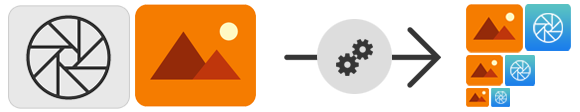

# mobile-toolbelt-assets



A tool for generating and converting image assets for all major mobile platforms.

## Install

```sh
$ npm install -g  mobile-toolbelt-assets
```

## Client usage

### Application images

You simply have to put all you HD assets into a folder (and its sub-folders).

### Application icon

You have to provide an HD black logo (with transparent background) and name it `appicon.png` in the root folder.

### Tool

```
Usage: mobile-toolbelt-assets [options]

Options:

  -h, --help                                       output usage information
  -V, --version                                    output the version number
  -w, --windows                                    generates assets for Windows projects (if not precised "all systems")
  -s, --ios                                        generates assets for iOS projects (if not precised "all systems")
  -a, --android                                    generates assets for Android projects  (if not precised "all systems")
  -b, --iconBackgroundColor [iconBackgroundColor]  the background color for iOS and Android generated icons
  -f, --iconForegroundColor [iconForegroundColor]  the foreground color for all generated icons
  -d, --dpi [dpi]                                  density of original HD assets (can be "@3x", "@2x", "ldpi" to "xxxdpi" or an integer in dpi) (default "@3x")
  -o, --output [ouput]                             the output folder where all generated assets will be created
  -i, --input [input]                              the input folder that contains all the original HD assets
```

## Module usage

The tool can be imported as a node module.

```javascript
var assets = require('mobile-toolbelt-assets');

assets.convertAssets(
  './in', // the input folder that contains all the original HD assets
  '@3x', // density of original HD assets
  './out/android', // the output folder where all generated assets will be created
  assets.systems.android, // the system for which assets will be generated (see "./systems" if you need a custom system)
  "#7ab678", // the background color for iOS and Android generated icons
  "#ffffff", // the foreground color for all generated icons
  function(err){

  });
```

## Example

An example of input and output result is available in the `sample/in` and `sample/out` folder.

## Why ?

When you have to make quickly an application, you don't always have time to polish all your assets : a cross-platform simple tool for converting all my assets and generating application icons was lacking.

## Roadmap / ideas

* Add unit tests
* Add support for more systems
* Add custom system support from a configuration file
* Improve resource auto-naming
* Clean source code

## Copyright and license

MIT © [Aloïs Deniel](http://aloisdeniel.github.io)
